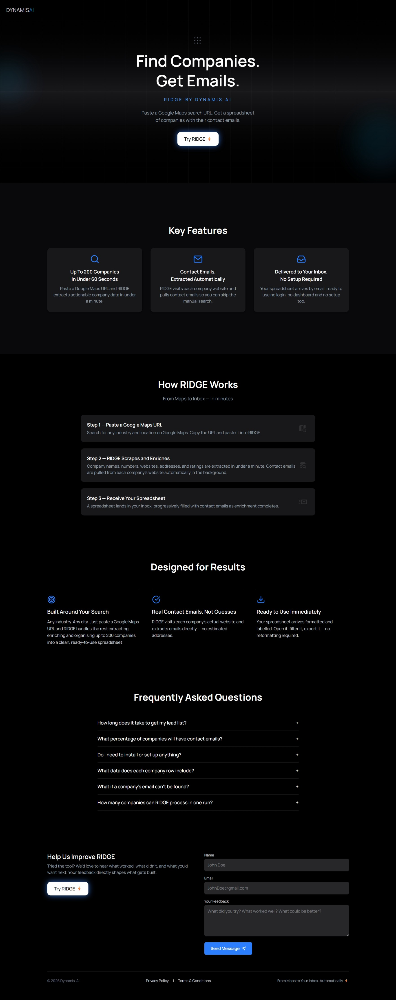
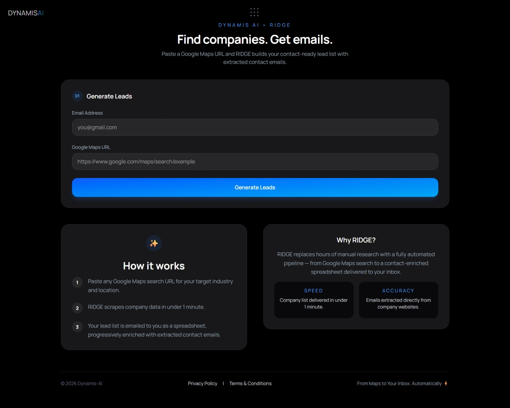
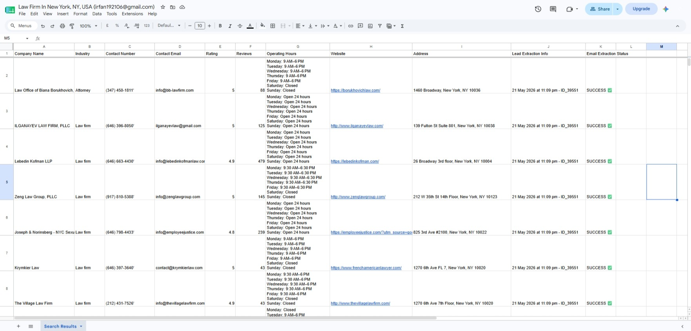

# RIDGE — Automated Lead Discovery & Contact Enrichment System

**Live:** [dynamis-ai.com](https://www.dynamis-ai.com)

RIDGE is a workflow automation system that transforms business discovery from a manual research task into an automated pipeline.

The platform transforms Google Maps searches into structured company lists, automatically enriches them with contact details, and delivers a ready‑to‑use spreadsheet for outreach or analysis.

The project was built to explore how workflow automation, AI-assisted processing, and low-code orchestration can eliminate repetitive lead generation tasks that are typically performed manually.

## Problem

Finding potential business leads often requires multiple disconnected steps:

1. Searching for companies
2. Collecting business information
3. Visiting websites individually
4. Locating contact details
5. Organizing results into spreadsheets

This process becomes increasingly time-consuming when repeated across dozens or hundreds of companies.

RIDGE was designed to automate this workflow from end to end.

## What It Does

1. **Search** — User submits a Google Maps search URL and email address
2. **Scrape** — Backend extracts up to 200 companies (name, industry, 
   phone, website, address, rating, hours) via SerpAPI
3. **Enrich** — Each company's website is visited and contact emails are 
   extracted automatically in the background
4. **Deliver** — A Google Sheet is created per request and emailed to 
   the user, populating progressively as enrichment completes

## Tech Stack

**Frontend:** Next.js, React, Tailwind CSS  
**Backend automation:** n8n (workflow orchestration)  
**Data source:** SerpAPI (Google Maps)  
**Storage & delivery:** Google Sheets API, Gmail  
**Hosting:** Vercel

## System Architecture

RIDGE is built as a workflow-driven system using n8n as the orchestration layer.

Pipeline:

Search Request
→ Lead Discovery
→ Contact Enrichment
→ Spreadsheet Generation
→ Email Delivery

The architecture separates user interaction from workflow execution, allowing long-running enrichment jobs to complete asynchronously.

## Architecture Highlights
- **Ping-pong workflow pattern** — two coordinated n8n workflows 
  (Email Enricher + Enricher Manager) recursively process leads in 
  batches of 15–20, avoiding execution timeouts on large datasets 
  (tested up to 200 companies per run)
- **Per-user dynamic spreadsheet creation** — each request generates 
  an isolated Google Sheet rather than writing to a shared dataset
- **Low-Code Automation Architecture** — The project combines:
  n8n, Google Sheets API, Gmail API, SerpAPI & Next.js to create a production-style 
  automation workflow with minimal operational overhead.

## Screenshots

### Landing Page

### Generate Leads

### Example Output

## Validated Results

Tested across multiple Malaysian industries (architecture, accounting, 
digital marketing, logistics):
- Up to 200 companies processed per search
- 55–67% contact email extraction rate on companies with websites
- Full pipeline (search → enriched spreadsheet) completes in 
  20–30 minutes for 150–200 company datasets

## Repository Scope
This repository serves as a project showcase and contains the frontend application only.
The workflow automation engine, integrations, and supporting infrastructure are not included.
